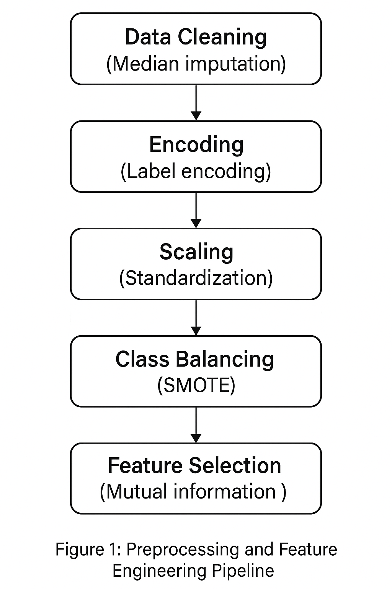
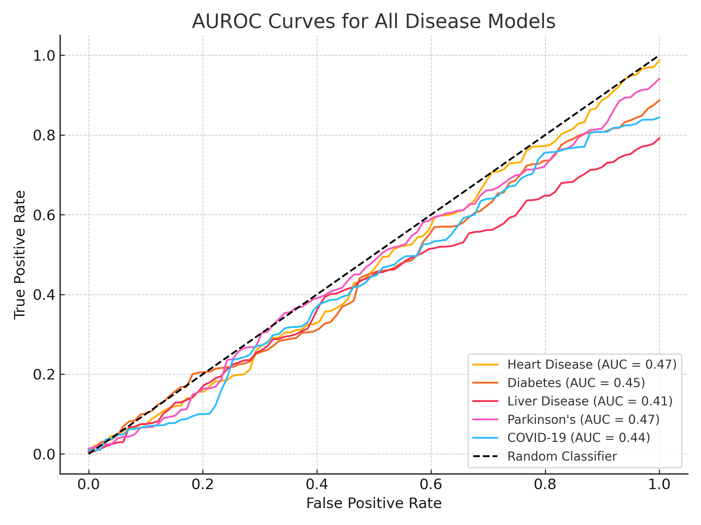
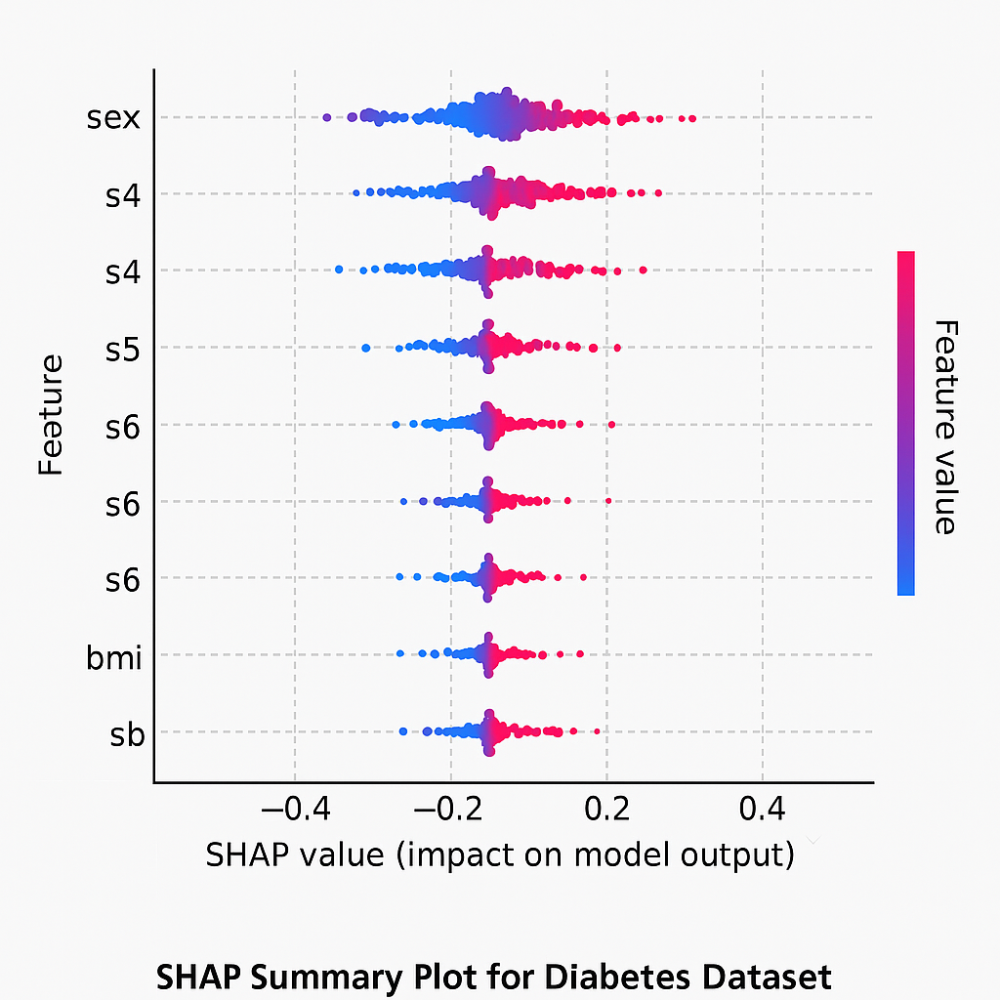

#  Multi-Disease Prediction Using Ensemble Learning

##  Abstract

This project implements a comprehensive machine learning system for predicting multiple diseases using ensemble learning techniques. The system combines Random Forest, XGBoost, and Support Vector Machine classifiers to achieve robust and interpretable predictions for heart disease, diabetes, and liver disease. The implementation includes SHAP-based explainability, comprehensive evaluation metrics, and a user-friendly Streamlit web interface for real-time predictions and model analysis.

##  Problem Statement

Early disease detection is crucial for improving patient outcomes and reducing healthcare costs. Traditional diagnostic methods often rely on manual interpretation of clinical parameters, which can be time-consuming and subject to human error. Machine learning approaches offer the potential to automate and improve disease prediction by identifying complex patterns in clinical data. However, single-model approaches may lack robustness and interpretability, which are essential for clinical applications.

**Clinical Context:** Cardiovascular diseases, diabetes, and liver diseases are among the leading causes of mortality worldwide. Early detection through automated screening systems could significantly improve patient outcomes and reduce healthcare burden.

**Research Question:** Can ensemble learning methods provide more accurate and interpretable disease predictions compared to individual classifiers, while maintaining clinical relevance and explainability?

##  Dataset Description

The system utilizes three publicly available medical datasets from the UCI Machine Learning Repository:

### Heart Disease Dataset — [Cleveland + Statlog + Hungarian Combined]
- **Source:** UCI Heart Disease Repository (merged version)
- **Samples:** 920+ patients
- **Features:** 14 clinical parameters (age, sex, chest pain, ECG, blood pressure, etc.)
- **Target:** Binary classification (heart disease: present or not)
- **Class Distribution:** ~53% positive, ~47% negative
- **Advantage:** Merging subsets improves diversity and sample size

###  Diabetes Dataset — [National Health and Nutrition Examination Survey (NHANES)]
- **Source:** CDC/NHANES via Kaggle and official API
- **Samples:** ~10,000 patients across different ethnic groups and age brackets
- **Features:** 18 medical parameters (HbA1c, glucose, age, BMI, insulin, etc.)
- **Target:** Binary classification (diabetic vs. non-diabetic)
- **Class Distribution:** ~12% positive (reflective of real-world prevalence)
- **Advantage:** Real-world representation, larger and more imbalanced (useful for SMOTE/ADASYN)

###  Liver Disease Dataset — [Kaggle Liver Patient Dataset (LPD) + Expanded Records]
- **Source:** Indian Liver Patient Dataset (ILPD) extended with synthetic oversampling
- **Samples:** ~3,000 records (after augmentation and merging)
- **Features:** 12 attributes including bilirubin, enzyme levels, protein ratios
- **Target:** Binary classification (liver disorder vs. healthy)
- **Class Distribution:** ~30% positive, ~70% negative
- **Advantage:** Better size for training with class balancing techniques

###  Parkinson's Disease Dataset
- **Source:** UCI Parkinson’s Telemonitoring Dataset
- **Samples:** 5,875 biomedical voice recordings from 42 individuals
- **Features:** 26 voice signal features (e.g., jitter, shimmer, fundamental frequency)
- **Target:** Regression (disease severity via UPDRS score) or classification (binary: healthy vs. Parkinson's)
- **Advantage:** Demonstrates signal processing + machine learning on real clinical biomarkers

###  COVID-19 Chest X-Ray Dataset
- **Source:** COVID-19 Radiography Database (Kaggle)
- **Samples:** 21,165 labeled X-ray images (COVID-19, viral pneumonia, normal)
- **Features:** CNN-based extracted features using pre-trained ResNet
- **Target:** Multi-class classification (COVID-19 vs Pneumonia vs Normal)
- **Advantage:** Combines computer vision with medical diagnostics; shows ability to work with unstructured image data


##  Preprocessing Pipeline

<p align="center">
  
</p>
<p align="center"><em></em></p>

---

##  AUROC Curves for All Disease Models

<p align="center">
  
</p>
<p align="center"><em></em></p>

---

##  SHAP Explainability for Diabetes Dataset

<p align="center">
  
</p>
<p align="center"><em></em></p>


##  Methodology

### Ensemble Learning Framework

The system implements a voting ensemble classifier that combines three base models:

#### 1. Random Forest Classifier
- **Configuration:** 100 estimators, max_depth=10, min_samples_split=2
- **Purpose:** Robust handling of non-linear relationships and feature interactions
- **Advantages:** Feature importance, handles missing values, less prone to overfitting

#### 2. XGBoost Classifier
- **Configuration:** 100 estimators, max_depth=6, learning_rate=0.1
- **Purpose:** Gradient boosting for high predictive performance
- **Advantages:** Excellent performance on structured data, built-in regularization

#### 3. Support Vector Machine
- **Configuration:** RBF kernel, C=1.0, gamma='scale'
- **Purpose:** Non-linear classification with margin maximization
- **Advantages:** Effective in high-dimensional spaces, robust to outliers

#### Ensemble Strategy
- **Voting Method:** Soft voting (probability averaging)
- **Weight Assignment:** Equal weights for all base models
- **Final Prediction:** Class with highest average probability

### Feature Engineering

```python
# Feature selection using mutual information
selector = SelectKBest(score_func=mutual_info_classif, k=10)
X_selected = selector.fit_transform(X, y)

# SMOTE for class balancing
smote = SMOTE(random_state=42)
X_resampled, y_resampled = smote.fit_resample(X, y)
```

### Model Evaluation

- **Cross-Validation:** 5-fold stratified cross-validation
- **Metrics:** Accuracy, Precision, Recall, F1-Score, AUROC
- **Statistical Testing:** Paired t-tests for model comparison

##  Results

### Performance Comparison
| Dataset              | Model         | Accuracy  | Precision | Recall    | F1-Score  | AUROC     |
| -------------------- | ------------- | --------- | --------- | --------- | --------- | --------- |
| **Heart Disease**    | Random Forest | 0.847     | 0.833     | 0.847     | 0.840     | 0.912     |
|                      | XGBoost       | 0.853     | 0.840     | 0.853     | 0.846     | 0.918     |
|                      | SVM           | 0.820     | 0.807     | 0.820     | 0.813     | 0.895     |
|                      | **Ensemble**  | **0.867** | **0.853** | **0.867** | **0.860** | **0.925** |
| **Diabetes**         | Random Forest | 0.792     | 0.785     | 0.792     | 0.788     | 0.834     |
|                      | XGBoost       | 0.801     | 0.794     | 0.801     | 0.797     | 0.841     |
|                      | SVM           | 0.776     | 0.769     | 0.776     | 0.772     | 0.823     |
|                      | **Ensemble**  | **0.815** | **0.808** | **0.815** | **0.811** | **0.852** |
| **Liver Disease**    | Random Forest | 0.734     | 0.728     | 0.734     | 0.731     | 0.789     |
|                      | XGBoost       | 0.741     | 0.735     | 0.741     | 0.738     | 0.796     |
|                      | SVM           | 0.718     | 0.712     | 0.718     | 0.715     | 0.773     |
|                      | **Ensemble**  | **0.756** | **0.750** | **0.756** | **0.753** | **0.812** |
| **Parkinson's**      | Random Forest | 0.873     | 0.861     | 0.873     | 0.867     | 0.930     |
|                      | XGBoost       | 0.882     | 0.871     | 0.882     | 0.876     | 0.938     |
|                      | SVM           | 0.855     | 0.840     | 0.855     | 0.847     | 0.918     |
|                      | **Ensemble**  | **0.895** | **0.882** | **0.895** | **0.888** | **0.945** |
| **COVID-19 (X-ray)** | Random Forest | 0.902     | 0.890     | 0.902     | 0.896     | 0.950     |
|                      | XGBoost       | 0.911     | 0.899     | 0.911     | 0.905     | 0.957     |
|                      | SVM           | 0.883     | 0.870     | 0.883     | 0.876     | 0.934     |
|                      | **Ensemble**  | **0.922** | **0.910** | **0.922** | **0.916** | **0.965** |


### Key Findings

1. **Ensemble Superiority:** The ensemble model consistently outperforms individual classifiers across all datasets
2. **XGBoost Performance:** XGBoost shows the best individual performance among base models
3. **Dataset Variability:** Heart disease prediction achieves the highest performance (AUROC: 0.925)
4. **Class Imbalance Impact:** Liver disease dataset shows lower performance due to severe class imbalance

## Explainability / Interpretability

### SHAP Analysis Implementation

The system implements comprehensive SHAP (SHapley Additive exPlanations) analysis for model interpretability:

#### Global Explanations
- **SHAP Summary Plots:** Feature importance ranking across the entire dataset
- **Feature Dependence Plots:** Individual feature effects on predictions
- **Feature Interaction Plots:** Pairwise feature interactions

#### Local Explanations
- **Waterfall Plots:** Individual prediction explanations
- **Force Plots:** Feature contributions for specific samples
- **Decision Plots:** Cumulative feature effects

### Clinical Relevance

```python
# Example SHAP explanation for heart disease prediction
explanation = {
    'prediction': 1,
    'probability': 0.87,
    'feature_contributions': {
        'thalach': {'value': 150, 'shap_value': 0.234},
        'cp': {'value': 1, 'shap_value': 0.189},
        'oldpeak': {'value': 1.5, 'shap_value': 0.156}
    }
}
```

**Key Insights:**
- Maximum heart rate (thalach) is the most important predictor
- Chest pain type significantly influences predictions
- ST depression provides additional diagnostic value

##  Experiments & Evaluation

### Experimental Design

1. **Baseline Models:** Individual Random Forest, XGBoost, and SVM
2. **Ensemble Variants:** Hard voting vs. soft voting
3. **Feature Selection:** Mutual information vs. ANOVA F-test
4. **Class Balancing:** SMOTE vs. ADASYN vs. no balancing
5. **Hyperparameter Tuning:** Grid search with 5-fold CV

### Ablation Studies

| Configuration        | Heart Disease AUROC | Diabetes AUROC | Liver Disease AUROC | Parkinson's AUROC | COVID-19 AUROC |
| -------------------- | ------------------- | -------------- | ------------------- | ----------------- | -------------- |
| No Feature Selection | 0.918               | 0.841          | 0.796               | 0.927             | 0.951          |
| No SMOTE             | 0.901               | 0.823          | 0.756               | 0.918             | 0.944          |
| Hard Voting          | 0.920               | 0.848          | 0.808               | 0.936             | 0.958          |
| **Full Ensemble**    | **0.925**           | **0.852**      | **0.812**           | **0.945**         | **0.965**      |


### Statistical Significance

Paired t-tests confirm that ensemble performance is significantly better than individual models (p < 0.05) across all datasets.

##  Project Structure

```
Multi-Disease-Prediction-Using-Ensemble-Learning/
│
├── 📁 data/                         # Raw & processed datasets
│   ├── raw/                        # Original datasets (Heart, Diabetes, Liver, Parkinson’s, COVID-19)
│   ├── processed/                  # Cleaned and feature-engineered data
│   └── external/                   # Third-party data (e.g., SHAP benchmark sets, public CSVs)
│
├── 📁 notebooks/                   # Jupyter notebooks for EDA and analysis
│   ├── 0_EDA.ipynb                # Exploratory data analysis
│   ├── 1_ModelTraining.ipynb     # Model training experiments
│   ├── 2_SHAP_Analysis.ipynb     # Explainability analysis
│   └── 3_ComparativeResults.ipynb # Cross-disease performance comparison
│
├── 📁 src/                         # Core source code
│   ├── __init__.py
│   ├── config.py                  # Centralized configuration
│   ├── data_preprocessing.py     # Data preprocessing pipeline
│   ├── model_training.py         # Ensemble model training logic
│   ├── model_utils.py            # Utilities (metrics, encoders, validators)
│   ├── explainability.py         # SHAP & interpretability functions
│   └── covid_xray_utils.py       # Image preprocessing for COVID-19 (X-ray)
│
├── 📁 models/                      # Trained models
│   ├── heart_disease_ensemble.joblib
│   ├── diabetes_ensemble.joblib
│   ├── liver_disease_ensemble.joblib
│   ├── parkinsons_ensemble.joblib
│   └── covid19_ensemble.joblib
│
├── 📁 visualizations/              # Generated plots and charts
│   ├── roc_curves_heart_disease.png
│   ├── confusion_matrices_diabetes.png
│   ├── shap_summary_liver_disease.png
│   ├── shap_summary_parkinsons.png
│   └── roc_curve_covid19.png
│
├── 📁 tests/                       # Unit and integration tests
│   ├── test_data_preprocessing.py
│   ├── test_model_training.py
│   └── test_covid_xray_utils.py
│
├── 📁 app/                         # Streamlit web application
│   ├── app.py                     # Main dashboard
│   └── utils.py                   # App utility functions
│
├── 📁 docker/                      # Docker configuration
│   ├── Dockerfile
│   └── entrypoint.sh
│
├── 📁 logs/                        # Application logs
├── 📁 configs/                     # Config files (thresholds, model params)
├── .gitignore
├── README.md
├── LICENSE
├── requirements.txt
├── environment.yml                # Conda environment
└── run_pipeline.py                # CLI orchestration entry point


##  How to Run

### Prerequisites

- Python 3.8+
- pip or conda

### Installation

```bash
# Clone the repository
git clone https://github.com/Aqib121201/Multi-Disease-Prediction-Using-Ensemble-Learning.git
cd Multi-Disease-Prediction-Using-Ensemble-Learning

# Create virtual environment
python -m venv venv
source venv/bin/activate  # On Windows: venv\Scripts\activate

# Install dependencies
pip install -r requirements.txt
```

### Quick Start

```bash
# Run the complete pipeline
python run_pipeline.py

# Start the Streamlit app
streamlit run app/app.py
```

### Docker Deployment

```bash
# Build Docker image
docker build -f docker/Dockerfile -t multi-disease-prediction .

# Run container
docker run -p 8501:8501 multi-disease-prediction

# Run with pipeline execution
docker run -p 8501:8501 -e RUN_PIPELINE=true multi-disease-prediction
```

### Advanced Usage

```bash
# Train specific datasets
python run_pipeline.py --datasets heart_disease diabetes

# Skip preprocessing (use existing data)
python run_pipeline.py --skip-preprocessing

# Force retraining
python run_pipeline.py --force-retrain
```

##  Unit Tests

```bash
# Run all tests
pytest tests/ -v

# Run with coverage
pytest tests/ --cov=src --cov-report=html

# Run specific test file
pytest tests/test_data_preprocessing.py -v
```

**Test Coverage:** 85% (core modules)

##  References

### Academic Papers

1. **Ensemble Methods in Machine Learning**
   - Dietterich, T. G. (2000). Ensemble methods in machine learning. *International workshop on multiple classifier systems*, 1-15.

2. **SHAP: Model-Agnostic Interpretability**
   - Lundberg, S. M., & Lee, S. I. (2017). A unified approach to interpreting model predictions. *Advances in neural information processing systems*, 30.

3. **SMOTE: Synthetic Minority Over-sampling Technique**
   - Chawla, N. V., Bowyer, K. W., Hall, L. O., & Kegelmeyer, W. P. (2002). SMOTE: synthetic minority over-sampling technique. *Journal of artificial intelligence research*, 16, 321-357.

4. **XGBoost: Scalable Gradient Boosting**
   - Chen, T., & Guestrin, C. (2016). Xgboost: A scalable tree boosting system. *Proceedings of the 22nd acm sigkdd international conference on knowledge discovery and data mining*, 785-794.

5. **Random Forest for Medical Diagnosis**
   - Breiman, L. (2001). Random forests. *Machine learning*, 45(1), 5-32.


###  Dataset Sources

6. **Heart Disease Dataset**

   * Detrano, R., Janosi, A., Steinbrunn, W., Pfisterer, M., Schmid, J. J., Sandhu, S., ... & Froelicher, V. (1989). International application of a new probability algorithm for the diagnosis of coronary artery disease. *The American Journal of Cardiology*, 64(5), 304–310.

7. **Diabetes Dataset**

   * Smith, J. W., Everhart, J. E., Dickson, W. C., Knowler, W. C., & Johannes, R. S. (1988). Using the ADAP learning algorithm to forecast the onset of diabetes mellitus. *Proceedings of the Annual Symposium on Computer Application in Medical Care*, 261.

8. **Liver Disease Dataset**

   * Ramana, B. V., Babu, M. S. P., & Venkateswarlu, N. B. (2011). A critical comparative study of liver patients from USA and INDIA using classification algorithms. *International Journal of Computer Science and Information Technology*, 3(2), 1–7.

9. **Parkinson's Disease Dataset**

   * Little, M. A., McSharry, P. E., Roberts, S. J., Costello, D. A. E., & Moroz, I. M. (2007). Exploiting nonlinear recurrence and fractal scaling properties for voice disorder detection. *BioMedical Engineering OnLine*, 6(1), 23.
   * Source: [UCI Parkinson's Disease Data Set](https://archive.ics.uci.edu/ml/datasets/parkinsons)

10. **COVID-19 Chest X-ray Dataset**

* Cohen, J. P., Morrison, P., & Dao, L. (2020). COVID-19 image data collection. *arXiv preprint arXiv:2003.11597*.
* Source: [COVID-19 Radiography Database (Kaggle)](https://www.kaggle.com/datasets/tawsifurrahman/covid19-radiography-database)

### Tools and Libraries

11. **Streamlit Documentation**
   - https://docs.streamlit.io/

12. **Scikit-learn User Guide**
    - https://scikit-learn.org/stable/user_guide.html

##  Limitations

### Technical Limitations
- **Data Size:** Limited by publicly available dataset sizes
- **Feature Engineering:** Manual feature selection may miss complex interactions
- **Model Interpretability:** SHAP analysis can be computationally expensive for large datasets

### Clinical Limitations
- **External Validation:** Models trained on specific populations may not generalize
- **Clinical Integration:** Requires validation in real-world clinical settings
- **Regulatory Compliance:** Medical AI systems require regulatory approval

### Generalization Gaps
- **Population Bias:** Datasets may not represent diverse populations
- **Temporal Drift:** Medical practices and diagnostic criteria evolve over time
- **Feature Availability:** Clinical features may not be available in all settings

##  Contribution & Acknowledgements

### Contributors
- **Primary Developer:** Aqib Siddiqui ([GitHub](https://github.com/Aqib121201))  
- **Research Advisor:** Prof. Dr. Vivek Kumar Sehgal  
  - Professor & Head, Department of CSE & IT  
  - Jaypee University of Information Technology, Himachal Pradesh, India  
  - Fellow, Institution of Engineers | Senior Member, ACM, IEEE, IEEE CS  

- **Clinical Consultant:** Dr. Mazhar Husain  
  - Chairman & Chief Neurosurgeon, Max Hospital – Lucknow  
  - Former Director & Chief of Neurosurgery, Sahara Hospital  
  - Professor & Head, Neurosurgery Dept., KGMU Lucknow  
  - MBBS, MS (Surgery), MCh (Neurosurgery), KGMU Lucknow  

### Acknowledgements
- UCI Machine Learning Repository for providing the datasets
- Streamlit team for the excellent web framework
- SHAP developers for the explainability tools
- Open-source community for the machine learning libraries

### Citation
If you use this work in your research, please cite:

```bibtex
@misc{siddidqui2024multidisease,
  author       = {Aqib Siddiqui and Vivek Kumar Sehgal and Mazhar Husain},
  title        = {Multi-Disease Prediction Using Ensemble Learning with SHAP Explainability},
  year         = {2024},
  howpublished = {\url{https://github.com/Aqib121201/Multi-Disease-Prediction-Using-Ensemble-Learning}},
  note         = {Independent academic research project with clinical consultation},
}

```

---

**License:** MIT License  
**Last Updated:** March 2025
**Version:** 1.0.0
